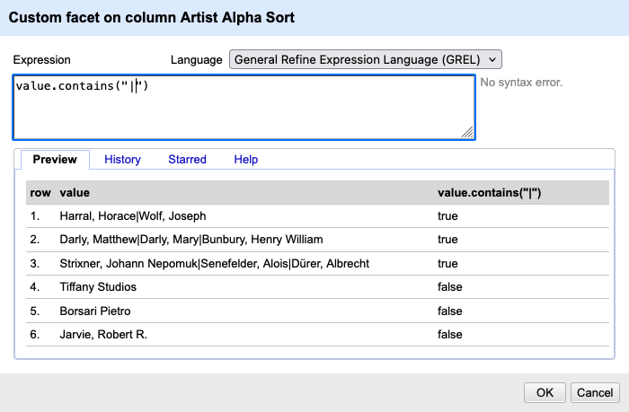

:::::::::::::::::::::::::::::::::::::: questions 

- When do we need a custom facet instead of a built-in one?  
- How can GREL help us explore and classify data more flexibly?  

::::::::::::::::::::::::::::::::::::::::::::::::

::::::::::::::::::::::::::::::::::::: objectives

- Understand what a custom facet is and how it differs from standard facets.  
- Learn to write simple GREL expressions for filtering and classifying data.  
- Create custom facets using GREL expressions to group and analyse data in new ways.

::::::::::::::::::::::::::::::::::::::::::::::::


## Creating a Custom Facet with GREL

::::::::::::: discussion

### How can we tell whether a cell contains one artist or several artists?

How can we check the column `Artist Display Name` to find out whether one or more people were involved in creating an artwork without splitting it? Look carefully at a few cells. What character consistently separates multiple names?

::::::::::::::::::::
 
So far, we have explored facets that you can create by clicking through the menu—text, numeric, and timeline facets. These are powerful, but sometimes an exploration or cleaning task requires a rule that is not built in. In those cases, OpenRefine lets us define our own facets using small expressions written in GREL. Don't worry if these terms are new to you. We demonstrate them with an example based on the dataset you already explored in the previous episode.


1. Open the column menu for `Artist Display Name`.

2. Choose `Facet → Custom text facet…`

:::instructor


A new window appears. You see a text field where you can enter the GREL function. At the bottom, there is a `Preview` section where you can see the value (i.e. the value in the table) and, to the right of that, the new value produced by the function. Under the `History` tab, you can view the commands that have been used, and under `Help` you find a detailed explanation.

::::::::

3. Enter the following expression:
   ```grel
   value.contains("|")
   ```
   This expression asks, “Does the cell contain a pipe?” For each row, OpenRefine evaluates the expression and returns either `true` or `false`.

4. Click `OK`. In the left panel, you now see a facet with two categories: `true` and `false`.

This small expression creates a logic-based facet that is not available as a built-in facet. It does not modify the data. It simply checks whether the condition is true or false for each row.

Why this works: A Custom facet runs your expression on every row, groups the results, and lets you filter by the outcome. You can write tests that return booleans (`true`/`false`), strings (e.g., normalized categories), or even numbers — OpenRefine facets whatever the expression returns.


:::::::::::::::::::::::::::::::::::::::::::: challenge

## Finding Titles with Quotation Marks

Create a custom text facet on the `Title` column and determine how many titles contain quotation marks. Then inspect a few examples and discuss why quotation marks might have been used.

Tip: You need to escape the quotation mark in the expression using a backslash (`\`).

::::::::::::::::::: solution

### Solution

The expression is:
```grel
value.contains("\"")
```
It returns 79 rows with the value `true`, meaning that 79 titles contain quotation marks. Looking at several examples suggests that quotation marks are often used when the title refers to a component of a larger work, such as an illustration in a book. This information could be important for a later analysis.

:::::::::::::::::::


::::::::::::::::::::::::::::::::::::::::::::

## What Is GREL?

GREL stands for General Refine Expression Language.  It is a small, specialized language used inside OpenRefine to:

- inspect cell values  
- transform text and numbers  
- check conditions  
- extract patterns  
- create new values on the fly  

GREL looks like code, but many useful expressions are short and readable. You can think of them as tiny instructions that tell OpenRefine how to interpret or transform the value currently in a cell (that value is referred to as `value` inside GREL). Many of the actions we have already performed can also be expressed directly in GREL, but to make things easier the most common functions are already built in. The menu simply provides shortcuts for the most common actions.


:::::::::::::::::::::::::::::::::::::::::::: challenge

## Detecting unusually long titles

Very long artwork titles may indicate data issues, such as multiple titles stored in one cell or comments included in the title field, but they can also reflect descriptive cataloguing practices.

Create a custom text facet on the column `Title` using the following GREL expression:

```grel
if(value.length() > 40, "long title", "short title")
```

* What does this expression do in your own words?

* How many long titles are there in the dataset?

::::::::::::::::::: solution

### Solution


The expression works as follows:

1. Inspect the cell with `value.length()`, which calculates the number of characters in the title.

2. The `if()` function checks whether the title has more than 40 characters (`value.length() > 40`). 

3. Produce a new output. If the condition is true, the expression returns "long title", otherwise it returns "short title". OpenRefine then groups rows according to these generated values.

This means the facet does not group by the original cell content, but by values that are generated by the expression.

There are 1009 long titles in the dataset. Looking at these entries shows that many titles include a description in addition to the actual title.
:::::::::::::::::::
::::::::::::::::::::::::::::::::::::::::::::

:::::::::: instructor

This challenge illustrates an important idea about custom facets. They do not have to group by the original cell content; they can group by computed values that you define using GREL.

::::::::::::::::::::

Coming back to our column `Artist Display Name`, you can also ask a more complex question: How many artists contributed to each artwork? This question cannot easily be answered using the menu interface alone. Instead of simply asking whether a pipe exists, we can count how many artist names are stored in a cell. To do this, we first split the text into a list and then count how many elements the list contains.

```grel
value.split("|").length()
```
In this expression, we chain two operations together. First, `split()` creates a list of names. Then `.length()` counts how many elements are in that list. In the window where you enter your GREL function, you can see the result it produces as you type.

:::::::::: instructor

 Go to the window and type `value.split("|")`. Show the group that this creates an array with a varying number of elements. Then add `.length()` to it and demonstrate that this now displays the number of elements in the array.

:::::::::

Working with GREL always starts with a question about the data.
That’s why we’re going to take a look at the most common GREL functions and what they do.


::::::::::::::::::::::::::::::::::::: callout

### Callout: GREL-Functions

Good places to look up your problem and the corresponding GREL function are:

* [OpenRefine's GitHub wiki](https://github.com/OpenRefine/OpenRefine/wiki/Recipes)
* [OpenRefine Documentation](https://openrefine.org/docs/manual/grelfunctions)

Some useful functions include:

* `value.toLowercase()` – lowercase the text.
* `value.trim()` – remove spaces at start/end.
* `value.length()` – number of characters.
* `value.contains("text")` – `true` if "text" occurs.
* `value.startsWith("A")`, `value.endsWith(".")` – prefix/suffix checks.
* `value.replace("old","new")` – literal replace.
* `value.replace(/\s+/," ")` – regex replace (collapse multiple spaces).
* `value.split(";")` – split into an array on `;`.
* `array.join("|")` – join array back to a string.

::::::::::::::::::::::::::::::::::::::::::::::::


::::::::::::::::::::::::::::::::::::: keypoints

- Custom facets group data using computed results from a GREL expression, not only the original cell values.  
- GREL is a lightweight language that allows you to inspect, classify, and analyse data inside OpenRefine. 
- Custom facets let you ask flexible questions about your data, such as identifying multiple creators or unusually long titles.
- With conditional expressions like `if()`, you can define new categories that support deeper exploration and data-quality checks.
- GREL functions can be chained together to answer more complex questions about your data.


::::::::::::::::::::::::::::::::::::::::::::::


