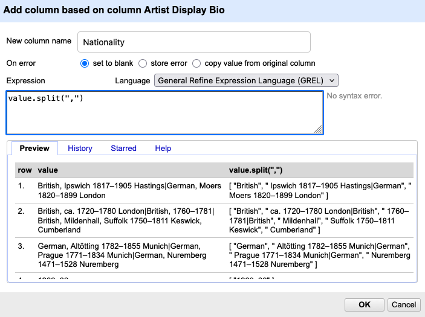
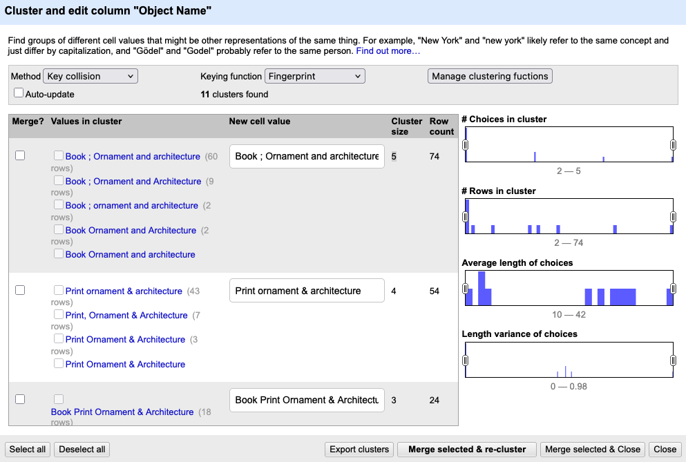

:::::::::::::::::::::::::::::::::::::: questions 

- How can GREL be used to extract information?
- What is the difference between modifying existing values and creating new columns?
- How can clustering help identify inconsistent values in a dataset?


::::::::::::::::::::::::::::::::::::::::::::::::

::::::::::::::::::::::::::::::::::::: objectives

- Apply GREL transformations to extract information.
- Create new columns based on existing data.
- Use arrays and indexing to select specific parts of a value.
- Use clustering to identify and review inconsistent values.


::::::::::::::::::::::::::::::::::::::::::::::::

## From Exploring Data to Cleaning Data

In the previous episodes, we used built-in and custom facets to explore our dataset and identify potential issues. Facets help us find patterns and problems, but they do not change the data itself. For further analysis, it is often useful to reorganize and standardize the data.

In this episode, we move from exploration to cleaning. We use transformations, column operations, and clustering to modify and standardize our data.

::::::::::::: discussion

### What information is stored in `Artist Display Bio`?

Look at several values in the column.

- What different kinds of information are stored together?
- What problems could this cause for later analysis?
- How could we separate these different pieces of information?

:::::::: instructor

Guide learners toward recognizing:

- nationality
- place names
- dates
- information on multiple artists

Emphasize that the column currently contains several different types of information. In the documentation of the dataset it states that `Artist Display Bio` contains information about "Nationality and life dates of an artist, also includes birth and death city when known".

::::::::::::

:::::::::::::::::::

### Splitting Multi-Valued Cells

The first step is to separate information about individual artists. As you learned in previous episodes, the pipe character (`|`) is used to separate information about multiple artists within a single cell.

To separate these artists into individual rows:

1. Open the column menu for `Artist Display Bio`.

2. Choose `Edit cells → Split multi-valued cells...`

3. Enter: `|`.

4. Confirm with `OK`.

You notice that some artists have only partial information, while others have much more detailed entries. Most complete entries follow a pattern similar to: 
`Nationality, Place Year–Year Place`.


### Creating New Columns and Extracting Information

Now we can begin extracting specific pieces of information. To preserve the original data, we create a new column rather than modifying the existing one. This is an important distinction: unlike the previous operation, which changed the structure of the dataset by creating new rows, we are now creating an additional column while keeping the original values unchanged.

:::::: challenge
### How to extract the Nationality?

Look at the column `Artist Display Bio`. How could you separate the nationality from the remaining information?

::::: solution

Most values follow the pattern: `Nationality, additional biographical information`

We can therefore split the text at the first comma and keep only the first element.

:::::::::
:::::::::

1. Open the column menu for `Artist Display Bio` .

2. Choose `Edit column  → Add column based on this column...`

3. A new window appears.

:::instructor


Describe the new window to the learners and remind them of the similarities from window in the prevoius episode.
On top you enter the name of the new column. At the bottom, there is a `Preview` section where you can see the value (i.e. the value in the table) and, to the right of that, the new value produced by the function. Under the `History` tab, you can view the commands that have been used, and under `Help` you find a detailed explanation.

::::

4. Name the new column `Nationality`.
5. Enter the GREL expression and check what happens in the `Preview` tab below
```grel
value.split(",")
```

The cell content is transformed from text into an array with three elements:

`American (born Germany), Frankfurt-am-Main 1863–1962 Staten Island, New York`

→

 `[ "American (born Germany)", " Frankfurt-am-Main 1863–1962 Staten Island", " New York" ]` 

 The list is called an array and stores the elements or values in a specific order. In OpenRefine, arrays are displayed unsing square brackets with elements separated by commas: `[value1, value2, value3]`. Each element has a position, called an index. Counting starts at 0, so the first element is accessed with `[0]`, the second with `[1]`, and so on. Since we are interested in the nationality, we only want the first element of the array.

 6. Add `[0]` to the end of the GREL expression.


 7. Click `OK` to create the new column.
 


:::::: challenge

### Additional cleaning

Look at the new `Nationality` column. It seems that the cells contain more than just nationalities.
Discuss the following questions:

- Which additional information is still present?
- Can you identify recurring patterns?
- How might these patterns be removed?

You do not need to propose a GREL expression. A description in natural language is sufficient.

::::: solution

Common issues include:

- Birth information in parentheses, such as `(born Germany)`.
- Uncertainty is marked with `(?)`
- Entries containing dates instead of nationalities.
- Entries containing place names where no nationality was recorded.
- Leading or trailing whitespace introduced during splitting.
- Information about active periods, such as `active 16th century`.

:::::::::
:::::::::


Data cleaning is rarely finished after a single transformation. Manual review is still necessary, but transformations can greatly reduce the amount of work required.

::: instructor

If the learners are eager to try more transformation and depending on their depending on their familiarity with regular expressions and programming concepts you can give them the grel functions and let them describe them in their own words and push them to try them out.

```grel
if(value.contains(/[0-9]/), "", value)
value.replace(" (?)", "")
value.replace(/ \(born[^)]*\)/, "")
if(value.contains("active"), "", value)
value.trim()
```

:::

:::::: challenge
### Extracting Life Dates

Once we have extracted the nationality, we can use a similar strategy to isolate other information stored in the same field. Life dates are another important piece of information that may be useful for later analysis.

Create a new column containing only the life dates of the artists.
Look again at the values in `Artist Display Bio`.
Can you create a new column that contains only the birth and death years?

::::: solution

Most life dates contain digits and a dash separating birth and death year.

One possible solution is:

```grel
value.replace(/[^0-9–-]/,"")
```

Explanation:
`value.replace(pattern, replacement)` replaces all parts of a value that match a given pattern.

In this example:

- `/ ... /` indicates that the pattern is written as a regular expression.
- `[0-9–-]` matches any digit (`0`–`9`) as well as dashes (`-` and `–`).
- `^` inside the square brackets reverses the selection. It means *"anything except"* the listed characters.

Therefore: `[^0-9–-]` means: match every character that is not a number or a dash.

The replacement string is empty (`""`), so all matching characters are removed.
:::::::::

:::::::::

## Clustering

Even after applying transformations, some inconsistencies remain. Not all problems can be solved with rules or regular expressions. Sometimes values differ only slightly because of spelling variations, abbreviations, or typing mistakes. In these cases, clustering can help identify potentially equivalent values. It identifies and normalizes variations — especially when different inconsistencies appear similar but not identical. We demonstrate clustering on the column `Object Name`.

1. Open the column menu for `Object Name`.

2. Choose `Edit cells  → Cluster and edit...`.

3. A new window appears. Click `Cluster`.

::: instructor


::::

The clustering window displays one suggested cluster per row. For each cluster the variations of a similar value with the count of rows they appear are shown on the left; a field on the right allows you to select or edit a preferred value.

For every suggested cluster you can decide to merge the values into a standardized form, to ignore the cluster if the variations are meaningful or to edit only some entries of the cluster. Clustering never changes anything automatically. OpenRefine simply helps you notice patterns you would otherwise miss.

Different clustering methods and keying functions identify different kinds of similarities. You do not need to understand the underlying algorithms. In practice, it is often sufficient to experiment with several methods and compare the results.


:::::::::::::::::::::::::::::::::::::::::::: challenge

## Cluster the Classification
 Look at the column `Classification` and try clustering the values by using different clustering methods and keying functions

- Which method produces the most useful suggestions?
- Which values are grouped together?
- What preprocessing step could improve the clustering results?

::::::::::::::::::: solution

### Solution

There is no single correct answer. Different clustering methods produce different suggestions.

One useful preprocessing step is to split multi-valued cells before clustering. If several classifications are stored together in one cell, clustering has difficulty identifying similarities between individual values.

:::::::::::::::::

::::::::::::::::::::::::::::::::::::::::::::

::::::::::::::::::::::::::::::::::::: keypoints

- GREL expressions can be used to extract, modify, and standardize information.
- Creating new columns preserves the original data and makes transformations easier to review.
- The `split()` function creates arrays that can be accessed using positions such as `[0]` and `[1]`.
- Structured information can be extracted from text using GREL expressions and pattern matching.
- Data cleaning often requires multiple transformation steps and manual review.
- Clustering helps identify potentially equivalent values and supports manual standardization.

::::::::::::::::::::::::::::::::::::::::::::::::
