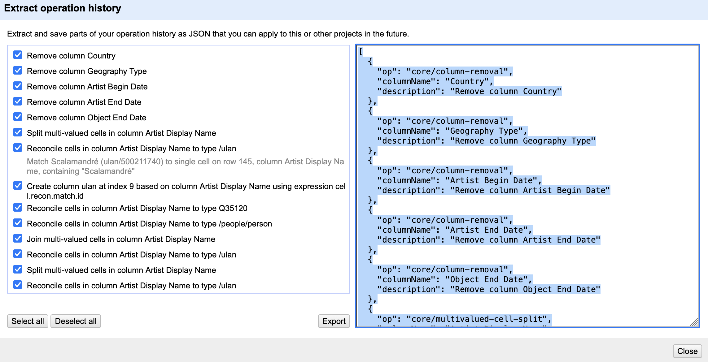

:::::::::::::::::::::::::::::::::::::: questions 

- How can we go back to an earlier step if we realize we made a mistake?  
- How can we save our cleaning process to repeat it later or share it with colleagues?
- How can we export the cleaned data?

::::::::::::::::::::::::::::::::::::::::::::::::

::::::::::::::::::::::::::::::::::::: objectives

- Use the Undo/Redo tab to reverse mistakes.  
- Export and Import workflows.  
- Understand the value of transparency and reproducibility in data cleaning.
- Export data in different formats.

::::::::::::::::::::::::::::::::::::::::::::::::

## Undo/Redo

On the left-hand side of the OpenRefine interface, you find the `Undo/Redo` tab. This tab lists every action you have taken since the project was created. Each action has a short label, such as *“Text transform on 2000 cells...* or *“Split multi-valued cells in column nationality”*.

1. Click on the `Undo/Redo` tab in the left sidebar.  
2. You see a list of all your steps in order. The most recent one is at the bottom.  
3. By selecting an earlier step in the list, you can roll the dataset back to exactly how it looked at that moment.  

This is like having a *time machine* for your dataset: you can test transformations freely without the fear of making permanent mistakes. And if you change your mind, you can always jump back to any earlier state. When cleaning messy data, we rarely get everything right on the first try.

Example: After splitting the `Artist Display Bio` column into multiple parts, you might notice that the country information was separated cleanly, but the century data became fragmented and less useful. Using Undo/Redo, you can jump back to the step *before* the split and try a different approach.

## Exporting and Importing Workflows

Undo/Redo does more than let you move backwards. It also keeps track of your entire cleaning process as a set of instructions. OpenRefine can export these instructions as a JSON file. This file does not contain the cleaned data itself, but only the cleaning steps which were applied to the data. 

1. Go to the `Undo/Redo` tab.  
2. Click on the button `Extract...`.  
3. A dialog opens showing all the processing steps in JSON on the right side. You can select which steps to include into the JSON by selecting the checkboxes on the left side.  

4. Save the processing steps to a JSON file by clicking `Export` or copy it manually to your clipboard and paste it into a file on your computer. 

Later, you or someone else can import this workflow into another OpenRefine project by clicking `Apply...` in the `Undo/Redo` tab in the other project. OpenRefine replays the exact same steps on the new dataset.

This feature is especially powerful in research, where transparency and reproducibility are essential. Instead of describing vaguely what was done, we can share the precise workflow that produced our dataset. Other researchers can review it, replicate it, or adapt it to their own data.

::::::::::::::::::::::::::::::::::::: callout

### Workflows as Reusable Recipes

Think of Undo/Redo export files as recipes. Just like a recipe tells you how to combine ingredients to bake a cake, an OpenRefine workflow tells you how to transform raw data into a cleaned dataset. If you don’t like the taste, you can always tweak the recipe.

::::::::::::::::::::::::::::::::::::::::::::::::

## Exporting data

The cleaned dataset can be exported in different formats like `tsv`, `csv`, `html` depending on your further planned work with the data. You find these options under `Export` on the right side of the project bar. Here you also have the option to export the entire OpenRefine project (data and processing history) for sharing it with colleagues or as a project backup. In this case you select `OpenRefine project to archive file` and an archive file (`.tar.gz`) will be downloaded to your computer. 

::::::::::::::::::::::::::::::::::::: callout
### Exporting pitfall

Ensure that no filters are active so that the entire dataset is exported. You can check this by looking at the information above the table, for example, “10 matching rows (1999 in total)”. In this case, only the subset of 10 data rows will be exported. Filters are easy to forget, especially when you have been exploring subsets of the data.

::::::::::::::::::::::::::::::::::::::::::::::::

::::::::::::: challenge

### Reuse a Workflow

One of OpenRefine’s strengths is that cleaning steps can be reused on similar datasets. Create a new OpenRefine project and import the original [data set](../episodes/data/met_dataset_oa.csv) again.
Open the `Undo/Redo` tab and apply the workflow JSON file you exported earlier. Compare the new project with your previous project.

- Which changes were reproduced automatically?
- Did the workflow recreate the same columns, transformations, and cleaning steps?
- Why is this useful when working with larger datasets or collaborating with other researchers?

:::::::::::::::::::

::::::::::::::::::::::::::::::::::::: keypoints 

- OpenRefine records every transformation you make.  
- The `Undo/Redo` tab lets you move backward and forward through your cleaning process.  
- Workflows can be exported as JSON and reapplied to other projects, ensuring transparency and reproducibility.  

::::::::::::::::::::::::::::::::::::::::::::::::